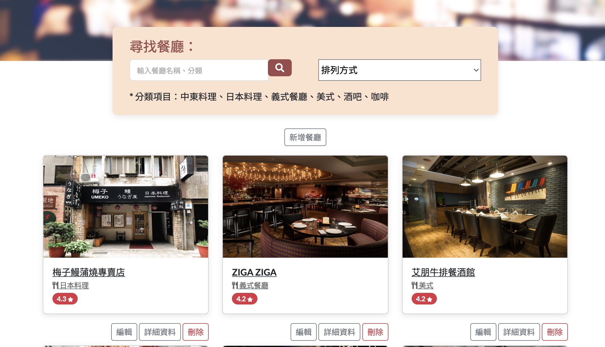

# Restaurant List
A simple web application for organizing favorite restaurant by searching, creating and deleting restaurant.



## Features
- Searching restaurants by name or category
- restaurant can be sorted by English name, region, category and rating
- Getting more information such as phone, address and description when click restaurant
- creating a new restaurant
- Delete restaurant from main page

### Getting started

1.Prepare node.js and npm first

2.Make sure in the directory and use local terminal :

```
npm install
```

3.Use Sequelize as ORM to manage MySQL 

```
npx sequelize db:create
```
```
npx sequelize db:migrate
```
```
npx sequelize db:seed
```

4. Setup ENV under .env.example file

```
SESSION_SECRET= "XXXXX"
```
5.Check environment variable NODE_ENV=development or ignore this step if under MAC/Linux systems

6.Then,

```
npm run start
```

4.Application is running successfully when you see

```
http://localhost:3000
```

5.Application can be paused by

```
ctrl + c
```

### Development Environment

- [Node.js](https://github.com/nvm-sh/nvm) 18.7.1
- [Express](https://www.npmjs.com/package/express) 4.18.2
- [Express Handlebars](https://github.com/express-handlebars/express-handlebars) 7.1.2
- [MySQL2](https://www.npmjs.com/package/mysql2) 3.2.0
- [Sequelize](https://www.npmjs.com/package/sequelize) 6.30.0
- [Sequelize-cli](https://www.npmjs.com/package/sequelize-cli) 6.6.0
- [Method-override](https://www.npmjs.com/package/method-override) 3.0.0
- [connect-flash](https://www.npmjs.com/package/connect-flash) 0.1.1
- [dotenv](https://www.npmjs.com/package/dotenv) 16.0.3
- [express-session](https://www.npmjs.com/package/express-session) 1.17.3
  